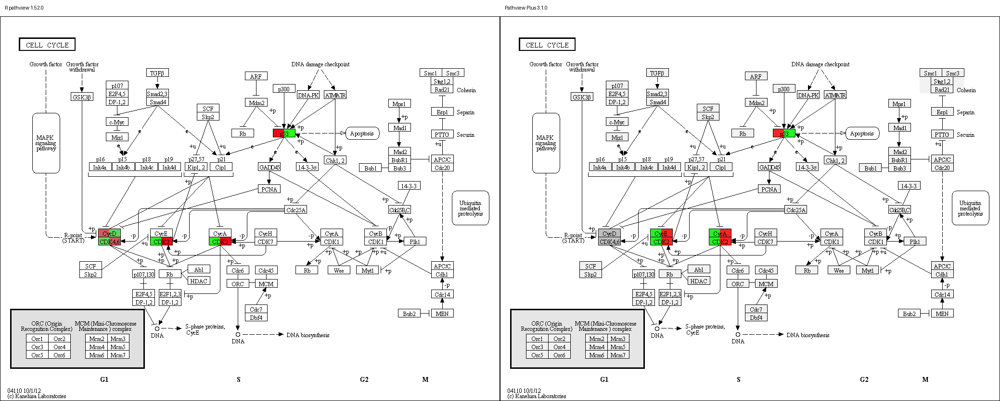
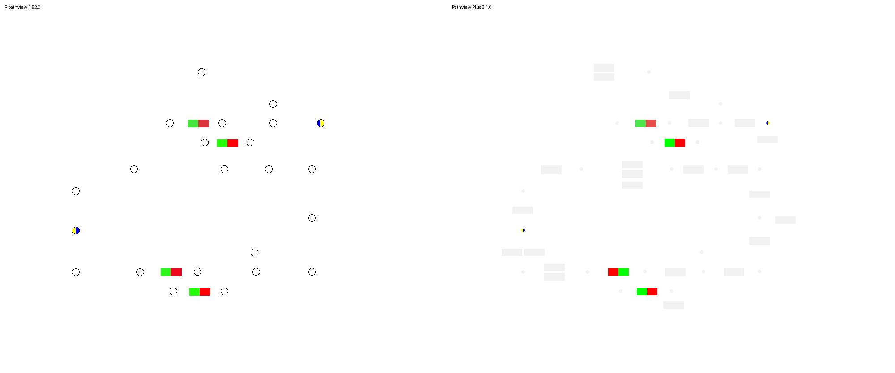
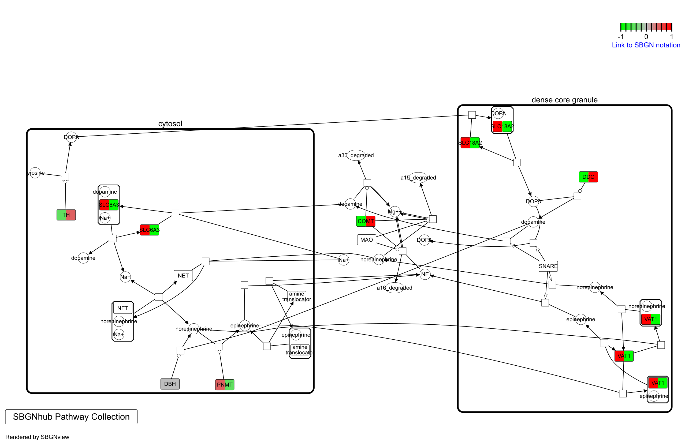
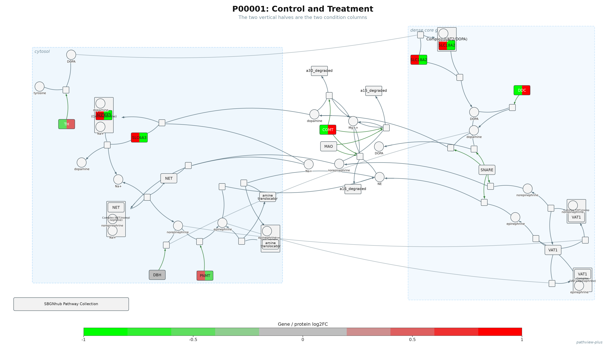

# Pathview Plus vs R Pathview and R SBGNview

**Date:** August 11, 2026  
**Comparison request:** Compare the new Python Pathview Plus with R Pathview and R SBGNview.

## My answer

I compared the new Pathview Plus with both R programs using the same pathway
files and the same data. The main coloring and pathway workflows worked in
both. There are still a few smaller differences in how the images and mappings
are handled.

| Comparison | What matched | What was different |
|---|---|---|
| R Pathview vs Pathview Plus | All 5 shared genes, left/right condition order, one to three conditions, raw map size, and gene + compound mapping | Python returned repeated/grouped KEGG rows and drew a smaller C00022 compound circle |
| R SBGNview vs Pathview Plus | All 7 shared genes, 78 total glyphs, 83 arcs, left/right condition order, and the same 9 direct glyph matches | R added 3 VAT1 matches from SLC18A2; Python kept but did not draw the state/clone marks |

## R Pathview vs Pathview Plus

| Check | R Pathview | Pathview Plus |
|---|---|---|
| Shared genes used | 5/5 | 5/5 |
| Two-condition order | Control left, Treatment right | Control left, Treatment right |
| Raw image size | 1039 x 801 | 1039 x 801 |
| One, two, and three conditions | Worked | Worked |
| Genes and compounds together | Worked | Worked |
| Rows returned for the 5 genes | 5 | 8 repeated/grouped pathway rows |
| C00022 circle radius | 8 pixels | 4 pixels |

The shared KEGG images were about **90.16% the same by pixel**. The average
color-channel difference was **1.39 out of 255**.

### Gene and compound comparison

Both versions mapped the gene and compound data. The clearest visual
difference is the compound-circle size.

## R SBGNview vs Pathview Plus

| Check | R SBGNview | Pathview Plus |
|---|---|---|
| Shared genes used | 7/7 | 7/7 |
| Pathway structure | 78 glyphs, 83 arcs | 76 main glyphs + 2 compartments, 83 arcs |
| Two-condition order | Control left, Treatment right | Control left, Treatment right |
| Direct mapped glyphs | 9 | 9 |
| SLC18A2/VAT1 mapping | Added 3 VAT1 glyphs | Did not add the 3 VAT1 glyphs |
| State and clone marks | Read and drawn | Read but not drawn |
| PNG and SVG output | Written | Written |

| R SBGNview | Python Pathview Plus |
|---|---|
|  |  |

## Test proof

- Pathview Plus full test suite: **321 passed, 6 skipped, 0 failed**.
- My Python comparison: **16 passed, 0 failed**.
- My R Pathview comparison: **10 passed with 1 measured image difference**.
- My R/Python SBGN checks: **17 passed, 0 failed**.
- Executed notebook: **11/11 code cells ran**.

## Bottom line

The new Python version did the main things I tested. It matched R on the input
genes, condition order, pathway structure, and main coloring workflows. The
parts I would compare next are compound size, grouped KEGG rows, the
SLC18A2/VAT1 mapping, and drawing the SBGN state and clone marks.

## Full evidence

- [Executed comparison notebook](notebooks/executed/01-pathview-v3-vs-r-and-sbgnview.executed.ipynb)
- [Short comparison summary](COMPARISON-SUMMARY.md)
- [R Pathview notes](reports/R-PATHVIEW-COMPARISON-NOTES.md)
- [R SBGNview notes](reports/SBGNVIEW-COMPARISON-NOTES.md)
- [Setup and rerun instructions](SETUP-AND-RERUN.md)

## Short update I can send

> I compared the new Pathview Plus directly with R Pathview and R SBGNview
> using the same pathway files and data. The main workflows matched, including
> the shared genes, left/right condition coloring, pathway structure, and gene
> plus compound mapping. The main differences I found were compound-circle
> size, repeated/grouped KEGG rows, the SLC18A2/VAT1 mapping, and drawing SBGN
> state/clone marks. I saved the side-by-side images, executed notebook, and
> full results in the August 11 folder.
