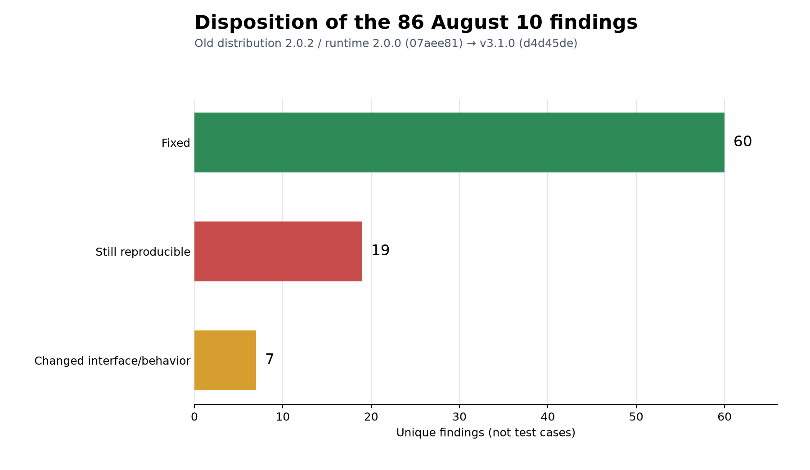
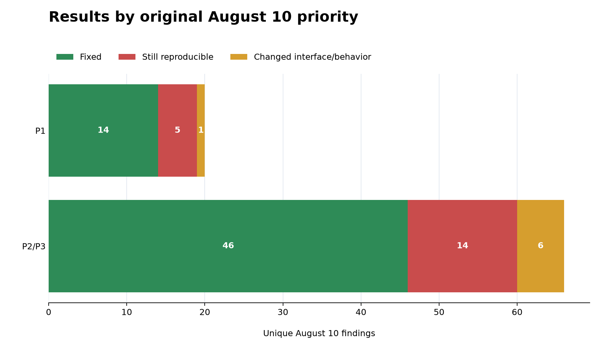
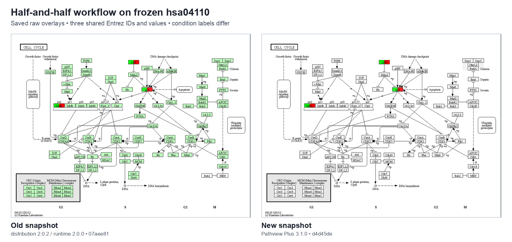

# Pathview Plus old-versus-new comparison — August 12, 2026

## Method

This is a follow-up to the August 10 audit. The unit of comparison is one of the same 86 unique finding IDs, not one test function and not one line of changed code.

The old side is commit `07aee813375347bcc933ad21b4aed561dd7cd3bf` (distribution `2.0.2`, runtime version string `2.0.0`). The new side is commit `d4d45decec56e1ebec15cf04ae62ff944851780e` (Pathview Plus `3.1.0`). For the new side, I used the saved status mapping, the adapted v3 checks, the current source review, and the saved final upstream JUnit result. The August 12 notebook then checked that the IDs, counts, hashes, tables, figures, and test proof were internally consistent.

The comparison is offline. The hsa04110 XML and PNG used for the visual check are frozen local files, and their SHA-256 hashes match across the old and new evidence. Live service behavior was not used to assign the 86 statuses.

I used the following narrow definitions for the status labels:

- **Fixed** means the exact August 10 failure condition was absent in a current test, an adapted check, or direct source inspection. It is not a claim that every related option is perfect.
- **Still reproducible** means a current equivalent still demonstrated the underlying behavior. Some rows are partial persistence: one part improved, while another part remains.
- **Changed interface/behavior** means the old call or contract was removed or replaced. Those seven rows receive neither a pass nor a fail because the old test is no longer like-for-like.

## Result

| Status at v3.1.0 | Number of unique August 10 findings |
|---|---:|
| Fixed | 60 |
| Still reproducible | 19 |
| Changed interface/behavior | 7 |
| **Total classified** | **86** |

Every old ID appears exactly once in the classification. The original priority labels were not reassigned:

| Original priority | Fixed | Still reproducible | Changed | Total |
|---|---:|---:|---:|---:|
| P1 | 14 | 5 | 1 | 20 |
| P2/P3 | 46 | 14 | 6 | 66 |
| **All** | **60** | **19** | **7** | **86** |

## What was fixed most often

The fixed findings cluster in four practical areas.

1. **Mapping and data handling:** cached species lookup, aggregation methods, ID normalization, null/duplicate mapping rows, common-name lookup, MyGene batching, and compound-only input now have working v3 checks.
2. **Parsing and structure:** namespace-qualified KGML and SBGN documents, state variables, clone markers, stable empty schemas, and port/identifier handling are covered by current tests.
3. **Rendering and highlighting:** compound position and size, SVG escaping, visible empty nodes, edge tables, highlight coordinates, opacity, labels, RGBA handling, and finite spline output were improved or verified.
4. **User-facing workflows:** the result object can be modified and saved, the command-line compound-only workflow runs, and the separate SBGN collection and `sbgnview()` entry points are real v3 paths rather than silent stubs.

The fixed list is in [`reports/FIXED-60.md`](reports/FIXED-60.md). Its criterion remains the narrow one above: the old condition was not reproduced at the v3 commit.

## Five P1 findings still reproducible

P1 is the original August 10 triage label. It is not a new severity score calculated for v3.

| ID | What the v3.1.0 recheck showed |
|---|---|
| `PV-BUG-006` | `map_null=False` is intended to omit unmapped pathway nodes. With one matched gene, v3.1.0 returned 27 pathway rows and only one row had a value, so the unmatched rows remained. |
| `PV-BUG-034` | A 120 × 100 native background was saved as a 792 × 664 composed PNG even with the title, color key, and signature disabled at 100 dpi. The public composed output therefore did not preserve the source pixel dimensions; this is separate from saving the raw raster. |
| `PV-BUG-038` | A graph node with two condition colors was reduced to one `node_color` value taken from the first condition, so graph/PDF mode did not preserve the split-state display. |
| `PV-BUG-074` | The Reactome constant still points to `https://reactome.org/ContentService/exporter/sbgn`, and the downloader still constructs `…/sbgn/{id}.sbgn`, the route form identified in the August 10 audit. |
| `PV-BUG-075` | For a node already labeled with Entrez ID `7157`, `_symbol_labels()` returned an empty map instead of replacing the rendered label with `TP53`; conversion was attempted only when the existing label was blank. |

The other 14 reproducible findings are documented with their original problem and current observation in [`reports/REMAINING-19.md`](reports/REMAINING-19.md).

## Seven findings whose interface changed

These rows are not counted as fixed. The old API or workflow was replaced in the areas of color configuration, identifier handling, string-valued columns, obstacle routing, output selection, CLI simulation, and non-KEGG dispatch. [`reports/CHANGED-7.md`](reports/CHANGED-7.md) records both sides of each change and a fair follow-up test.

Because the contract changed, an old test result cannot answer whether the replacement is correct. It needs a new v3-native test.

## Saved visual check

The figure compares two saved raw overlays. Both are 1039 × 801 and use equivalent inputs: the same three Entrez IDs and numeric values, with condition names changed from `Classical`/`Basal` to `Low`/`High` in the v3 evidence. The image is a workflow check, not a rerun of both versions by the August 12 script, and it does not resolve `PV-BUG-034`; that finding concerns the dimensions of the Matplotlib-composed native output.

## Test evidence and why 19 findings can remain

The August 10 audit recorded 239 test-case outcomes: 143 ordinary passes, 89 known-bug reproductions, 7 feature-gap reproductions, and 0 unexplained failures. Those outcomes produced the 86 unique IDs followed here.

The saved v3 upstream run collected 327 tests, with 321 passes, 6 skips, and 0 failures. The skips were three opt-in live-network SBGN checks, two RData checks without their source fixture, and one optional-dependency branch.

The two suites answer different questions. The v3 upstream tests are not a one-to-one regression test for every old finding, so a clean upstream run can coexist with 19 unresolved rows in this historical follow-up. The 60/19/7 table is the relevant result for the old audit list.

## Limitations and next work

The v3 status evidence was produced from the August 11 source checkout and is preserved unchanged under `outputs-that-matter/proof/`. The August 12 work assembled the report, checked the joins and saved artifacts, and executed the comparison notebook. It did not modify Pathview Plus source code.

The next technical pass should add direct v3 regression tests for the 19 reproducible findings, beginning with the five P1 rows. The seven changed interfaces need migration notes and replacement tests rather than being silently carried forward as “fixed.” These results support continued documentation and user testing, but the August 10 list is not closed.
